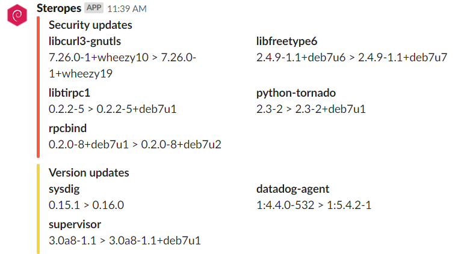

# apt-slack

A simple bash script which runs with `cron` to post on Slack available packet updates. Updates are split into `Version` (Yellow) and `Security` (Red) releases.



# crontab

Just an example with `cron.d`:
```
0 2 * * WED user /home/user/apt-slack.sh
```

# config

Add your *Slack webhook URL* in variable `SLACK_HOOK`.

# author

Thomas Labarussias - https://github.com/Issif